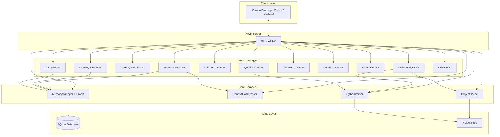

# Hi-AI

<div align="center">

[](https://smithery.ai/server/@su-record/hi-ai)
[](https://www.npmjs.com/package/@su-record/hi-ai)
[](https://opensource.org/licenses/MIT)
[](https://modelcontextprotocol.io)
[](https://github.com/su-record/hi-ai)
[](https://github.com/su-record/hi-ai)

**Model Context Protocol 기반 AI 개발 어시스턴트**

TypeScript + Python 지원 · 35개 전문 도구 · 지식 그래프 메모리 · 세션 컨텍스트 자동 주입

<a href="https://glama.ai/mcp/servers/@su-record/hi-ai">
  
</a>

[한국어](README.md)

</div>

---

## 목차

- [개요](#개요)
- [주요 기능](#주요-기능)
- [v2.1.0 업데이트](#v210-업데이트)
- [설치](#설치)
- [도구 카탈로그](#도구-카탈로그)
- [아키텍처](#아키텍처)
- [성능](#성능)
- [개발 가이드](#개발-가이드)
- [라이선스](#라이선스)

---

## 개요

Hi-AI는 **Model Context Protocol (MCP)** 표준을 구현한 AI 개발 어시스턴트입니다. 자연어 기반 키워드 인식을 통해 35개의 전문화된 도구를 제공하며, 개발자가 복잡한 작업을 직관적으로 수행할 수 있도록 돕습니다.

### 핵심 가치

- **자연어 기반**: 한국어/영어 키워드로 도구를 자동으로 실행
- **지식 그래프 메모리**: 메모리 간 관계를 그래프로 구성하여 연관 정보 탐색
- **다중 언어 지원**: TypeScript, JavaScript, Python 코드 분석
- **의존성 분석**: 코드 간 의존 관계 시각화 및 순환 참조 감지
- **엔터프라이즈 품질**: 100% 테스트 커버리지 및 엄격한 타입 시스템

---

## 주요 기능

### 1. 지식 그래프 메모리 시스템

메모리 간 관계를 그래프로 구성하여 연관 정보를 탐색하는 11개의 도구:

- **세션 컨텍스트 자동 주입**: 세션 시작 시 이전 메모리와 지식 그래프를 자동으로 로드 (v2.1 신규)
- **관계 연결**: 메모리 간 의미론적 관계 설정 (related_to, depends_on, implements 등)
- **그래프 탐색**: BFS/DFS 알고리즘을 통한 연관 메모리 탐색
- **멀티 전략 검색**: 5가지 검색 전략 지원 (keyword, graph_traversal, temporal, priority, context_aware)
- **타임라인**: 시간순 메모리 히스토리 시각화

**주요 도구**:
- `get_session_context` - 🚀 세션 시작 시 컨텍스트 자동 로드 (v2.1 신규)
- `save_memory` - 장기 메모리에 정보 저장
- `recall_memory` - 저장된 정보 검색
- `link_memories` - 메모리 간 관계 연결
- `get_memory_graph` - 지식 그래프 조회
- `search_memories_advanced` - 멀티 전략 검색
- `create_memory_timeline` - 타임라인 생성
- `prioritize_memory` - 메모리 우선순위 관리

### 2. 시맨틱 코드 분석

AST 기반 코드 분석 및 탐색 도구:

- **심볼 검색**: 프로젝트 전체에서 함수, 클래스, 변수 위치 파악
- **참조 추적**: 특정 심볼의 모든 사용처 추적
- **의존성 그래프**: 코드 간 의존 관계 시각화 (v2.0 신규)
- **순환 참조 감지**: 순환 의존성 자동 탐지 (v2.0 신규)
- **다중 언어**: TypeScript, JavaScript, Python 지원

**주요 도구**:
- `find_symbol` - 심볼 정의 검색
- `find_references` - 심볼 참조 찾기
- `analyze_dependency_graph` - 의존성 그래프 분석 (v2.0 신규)

### 3. 코드 품질 분석

포괄적인 코드 메트릭 및 품질 평가:

- **복잡도 분석**: Cyclomatic, Cognitive, Halstead 메트릭
- **결합도/응집도**: 모듈 구조 건전성 평가
- **품질 점수**: A-F 등급 시스템
- **개선 제안**: 실행 가능한 리팩토링 방안

**주요 도구**:
- `analyze_complexity` - 복잡도 메트릭 분석
- `validate_code_quality` - 코드 품질 평가
- `check_coupling_cohesion` - 결합도/응집도 분석
- `suggest_improvements` - 개선 제안
- `apply_quality_rules` - 품질 규칙 적용
- `get_coding_guide` - 코딩 가이드 조회

### 4. 프로젝트 계획 도구

체계적인 요구사항 분석 및 로드맵 생성:

- **PRD 생성**: 제품 요구사항 문서 자동 생성
- **사용자 스토리**: 수용 조건 포함 스토리 작성
- **MoSCoW 분석**: 요구사항 우선순위화
- **로드맵 작성**: 단계별 개발 일정 계획

**주요 도구**:
- `generate_prd` - 제품 요구사항 문서 생성
- `create_user_stories` - 사용자 스토리 작성
- `analyze_requirements` - 요구사항 분석
- `feature_roadmap` - 기능 로드맵 생성

### 5. 순차적 사고 도구

구조화된 문제 해결 및 의사결정 지원:

- **문제 분해**: 복잡한 문제를 단계별로 분해
- **사고 체인**: 순차적 추론 과정 생성
- **다양한 관점**: 분석적/창의적/체계적/비판적 사고
- **실행 계획**: 작업을 실행 가능한 계획으로 변환

**주요 도구**:
- `create_thinking_chain` - 사고 체인 생성
- `analyze_problem` - 문제 분석
- `step_by_step_analysis` - 단계별 분석
- `format_as_plan` - 계획 형식화

### 6. 프롬프트 엔지니어링

프롬프트 품질 향상 및 최적화:

- **자동 강화**: 모호한 요청을 구체적으로 변환
- **품질 평가**: 명확성, 구체성, 맥락성 점수화
- **Gemini 최적화**: Google Gemini API 프롬프팅 전략

**주요 도구**:
- `enhance_prompt` - 프롬프트 강화
- `analyze_prompt` - 프롬프트 품질 분석
- `enhance_prompt_gemini` - Gemini 프롬프팅 전략

### 7. 추론 프레임워크

복잡한 문제의 체계적 분석:

- **9단계 추론**: 문제 분해, 가설 탐색, 위험 평가
- **논리적 검증**: 완전성과 정밀성 보장

**주요 도구**:
- `apply_reasoning_framework` - 9단계 추론 프레임워크

### 8. 사용 분석 (v2.0 신규)

도구 사용 통계 및 분석:

- **메모리 통계**: 카테고리별 분포, 시간별 활동
- **그래프 분석**: 연결 통계, 클러스터 정보

**주요 도구**:
- `get_usage_analytics` - 사용 분석 조회

### 9. UI 프리뷰 & 시간

- `preview_ui_ascii` - ASCII UI 프리뷰
- `get_current_time` - 현재 시간 조회

---

## Hi-GCloud 연동

Hi-AI는 [hi-gcloud](https://github.com/su-record/hi-gcloud) MCP와 함께 사용하면 강력한 GCP 운영 + 코드 수정 워크플로우를 제공합니다.

### 연동 방식

hi-gcloud에서 에러를 발견하면 hi-ai 도구를 자동으로 추천합니다:

```
📋 Cloud Run 로그: my-api
🔴 3개의 에러가 발견되었습니다.

💡 hi-ai 연동 가능: 에러 분석이 필요하면 analyze_problem 도구로 원인을 분석하고,
   관련 코드를 찾아 수정 방안을 제시할 수 있습니다.
```

### 워크플로우 예시

```
User: "배포가 실패했어"

[hi-gcloud]
→ gcp_run_logs로 에러 로그 조회
→ 에러 3건 발견, hi-ai 연동 힌트 제공

[hi-ai 자동 연동]
→ analyze_problem으로 에러 원인 분석
→ find_symbol로 관련 코드 위치 파악
→ suggest_improvements로 수정 방안 제시
→ save_memory로 해결 방법 저장 (재발 방지)
```

### 설치

두 MCP를 함께 설치하면 자동으로 연동됩니다:

```json
{
  "mcpServers": {
    "hi-ai": {
      "command": "npx",
      "args": ["-y", "@su-record/hi-ai"]
    },
    "hi-gcloud": {
      "command": "npx",
      "args": ["-y", "@polin-go/hi-gcloud"]
    }
  }
}
```

### 연동 도구 매핑

| hi-gcloud 상황 | hi-ai 추천 도구 |
|---------------|-----------------|
| 에러 로그 발견 | `analyze_problem`, `find_symbol` |
| 배포 실패 | `step_by_step_analysis`, `suggest_improvements` |
| 성능 문제 | `analyze_complexity`, `check_coupling_cohesion` |
| 비용 증가 | `format_as_plan` |

---

## v2.1.0 업데이트

### 주요 변경사항

Hi-AI v2.1.0은 **세션 컨텍스트 자동 주입** 기능을 도입한 마이너 릴리스입니다.

### 신규 기능

| 기능 | 설명 |
|------|------|
| `get_session_context` 도구 | 세션 시작 시 이전 메모리, 지식 그래프, 타임라인을 한 번에 조회 |
| `hi-ai://context/session` 리소스 | 클라이언트가 리소스를 읽을 때 자동으로 컨텍스트 제공 |
| 도구 description 개선 | LLM이 세션 시작 시 자동으로 컨텍스트를 파악하도록 유도 |

### 변경 요약

| 항목 | v2.0.0 | v2.1.0 | 변화 |
|------|--------|--------|------|
| 도구 개수 | 34개 | 35개 | +1개 |
| 리소스 개수 | 3개 | 4개 | +1개 |
| 세션 컨텍스트 | 수동 | 자동 권장 | 개선 |

---

## v2.0.0 업데이트

### 주요 변경사항

Hi-AI v2.0.0은 지식 그래프 기반 메모리 시스템과 고급 코드 분석 기능을 도입한 메이저 릴리스입니다.

### 신규 기능 (6개 도구)

| 도구 | 설명 |
|------|------|
| `link_memories` | 메모리 간 관계 연결 (지식 그래프) |
| `get_memory_graph` | 지식 그래프 조회/시각화 (Mermaid 다이어그램 지원) |
| `search_memories_advanced` | 5가지 전략의 멀티 검색 |
| `create_memory_timeline` | 시간순 메모리 타임라인 |
| `analyze_dependency_graph` | 코드 의존성 분석 및 순환 참조 감지 |
| `get_usage_analytics` | 사용 통계/분석 |

### 아키텍처 개선

- **index.ts**: 37개 switch case → 동적 디스패치 패턴
- **MemoryManager**: 지식 그래프 기능 추가 (395줄 → 823줄)
- **코드 최적화**: 불필요한 의존성 제거 (puppeteer-core)

---

## 설치

### 시스템 요구사항

- Node.js 18.0 이상
- TypeScript 5.0 이상
- MCP 호환 클라이언트 (Claude Desktop, Cursor, Windsurf)
- Python 3.x (Python 코드 분석 시)

### 설치 방법

#### NPM 패키지

```bash
# 글로벌 설치
npm install -g @su-record/hi-ai

# 로컬 설치
npm install @su-record/hi-ai
```

#### Smithery 플랫폼

```bash
# 원클릭 설치
https://smithery.ai/server/@su-record/hi-ai
```

### MCP 클라이언트 설정

Claude Desktop 또는 다른 MCP 클라이언트의 설정 파일에 추가:

```json
{
  "mcpServers": {
    "hi-ai": {
      "command": "hi-ai",
      "args": [],
      "env": {}
    }
  }
}
```

---

## 도구 카탈로그

### 전체 도구 목록 (35개)

| 카테고리 | 도구 수 | 도구 목록 |
|----------|---------|-----------|
| **메모리 - 기본** | 6 | save_memory, recall_memory, list_memories, delete_memory, update_memory, prioritize_memory |
| **메모리 - 그래프** | 4 | link_memories, get_memory_graph, search_memories_advanced, create_memory_timeline |
| **메모리 - 세션** | 1 | get_session_context 🚀 |
| **코드 분석** | 3 | find_symbol, find_references, analyze_dependency_graph |
| **사고** | 4 | create_thinking_chain, analyze_problem, step_by_step_analysis, format_as_plan |
| **코드 품질** | 6 | analyze_complexity, validate_code_quality, check_coupling_cohesion, suggest_improvements, apply_quality_rules, get_coding_guide |
| **계획** | 4 | generate_prd, create_user_stories, analyze_requirements, feature_roadmap |
| **프롬프트** | 3 | enhance_prompt, analyze_prompt, enhance_prompt_gemini |
| **추론** | 1 | apply_reasoning_framework |
| **분석** | 1 | get_usage_analytics |
| **UI** | 1 | preview_ui_ascii |
| **시간** | 1 | get_current_time |

### 키워드 매핑 예시

#### 메모리 도구

| 도구 | 한국어 | 영어 |
|------|--------|------|
| save_memory | 기억해, 저장해 | remember, save this |
| recall_memory | 떠올려, 기억나 | recall, remind me |
| get_session_context | 세션 시작, 컨텍스트 | session start, context |
| link_memories | 연결해, 관계 | link, connect |
| get_memory_graph | 그래프, 관계도 | graph, relations |
| search_memories_advanced | 고급 검색, 찾아 | advanced search, find |

#### 코드 분석 도구

| 도구 | 한국어 | 영어 |
|------|--------|------|
| find_symbol | 함수 찾아, 클래스 어디 | find function, where is |
| analyze_dependency_graph | 의존성, 관계 | dependency, relations |
| analyze_complexity | 복잡도, 복잡한지 | complexity, how complex |
| validate_code_quality | 품질, 리뷰 | quality, review |

---

## 아키텍처

### 시스템 구조



### 핵심 컴포넌트

#### MemoryManager (v2.0 확장)
- **역할**: 영구 메모리 저장소 및 지식 그래프 관리
- **기술**: SQLite, better-sqlite3
- **기능**: CRUD, 검색, 우선순위, 그래프 관계, BFS/DFS 탐색
- **최적화**: WAL 모드, 인덱싱, Prepared Statements

#### ContextCompressor
- **역할**: 컨텍스트 압축 관리
- **알고리즘**: 우선순위 기반 압축
- **기능**: 중요도에 따른 선택적 보존

#### ProjectCache
- **역할**: ts-morph 프로젝트 캐싱
- **전략**: LRU 알고리즘
- **기능**: 반복 분석 성능 향상
- **제한**: 100MB/프로젝트, 200MB 전체

#### PythonParser
- **역할**: Python 코드 AST 분석
- **방법**: subprocess 실행
- **기능**: 심볼 추출, 복잡도 계산
- **안전**: 타임아웃, 자동 정리

### 데이터베이스 스키마 (v2.0)

```sql
-- memories 테이블
CREATE TABLE memories (
  key TEXT PRIMARY KEY,
  value TEXT NOT NULL,
  category TEXT NOT NULL DEFAULT 'general',
  timestamp TEXT NOT NULL,
  lastAccessed TEXT NOT NULL,
  priority INTEGER DEFAULT 0
);

-- memory_relations 테이블 (v2.0 신규)
CREATE TABLE memory_relations (
  id INTEGER PRIMARY KEY AUTOINCREMENT,
  sourceKey TEXT NOT NULL,
  targetKey TEXT NOT NULL,
  relationType TEXT NOT NULL,
  strength REAL DEFAULT 1.0,
  metadata TEXT,
  timestamp TEXT NOT NULL,
  UNIQUE(sourceKey, targetKey, relationType)
);
```

---

## 성능

### 주요 최적화

#### 프로젝트 캐싱
- LRU 캐시를 통한 반복 분석 성능 향상
- 5분 TTL로 최신 상태 유지
- 메모리 제한을 통한 리소스 관리

#### 메모리 작업
- SQLite 트랜잭션으로 배치 작업 최적화
- 시간 복잡도 개선: O(n²) → O(n)
- 인덱싱을 통한 빠른 조회

#### 그래프 탐색 (v2.0)
- BFS/DFS 알고리즘으로 효율적 탐색
- Union-Find로 클러스터 감지
- 경로 찾기 최적화

---

## 개발 가이드

### 환경 설정

```bash
# 리포지토리 클론
git clone https://github.com/su-record/hi-ai.git
cd hi-ai

# 의존성 설치
npm install

# 빌드
npm run build

# 개발 모드
npm run dev
```

### 테스트

```bash
# 전체 테스트 실행
npm test

# Watch 모드
npm run test:watch

# UI 모드
npm run test:ui

# 커버리지 리포트
npm run test:coverage
```

### 코드 스타일

- **TypeScript**: strict 모드
- **타입**: `src/types/tool.ts` 사용
- **테스트**: 100% 커버리지 유지
- **커밋**: Conventional Commits 형식

### 새 도구 추가

1. `src/tools/category/` 디렉토리에 파일 생성
2. `ToolDefinition` 인터페이스 구현
3. `src/index.ts`의 `toolHandlers`에 등록
4. `tests/unit/` 디렉토리에 테스트 작성
5. README 업데이트

---

## 기여자

<a href="https://github.com/su-record/hi-ai/graphs/contributors">
  
</a>

### 특별 감사

- **[Smithery](https://smithery.ai)** - MCP 서버 배포 및 원클릭 설치 플랫폼 제공

---

## 라이선스

MIT License - 자유롭게 사용, 수정, 배포 가능

---

## 인용

이 프로젝트를 연구나 상업적 용도로 사용하실 경우:

```bibtex
@software{hi-ai2025,
  author = {Su},
  title = {Hi-AI: Knowledge Graph-Based MCP Server for AI-Assisted Development},
  year = {2025},
  version = {2.1.0},
  url = {https://github.com/su-record/hi-ai}
}
```

---

<div align="center">

## Star History

[](https://star-history.com/#su-record/hi-ai&Date)

<br>

**Hi-AI v2.1.0**

지식 그래프 메모리 · 세션 컨텍스트 자동 주입 · 의존성 분석 · 35개 전문 도구

Made with ❤️ by [Su](https://github.com/su-record)

<br>

[🏠 Homepage](https://github.com/su-record/hi-ai) ·
[📚 Documentation](https://github.com/su-record/hi-ai#readme) ·
[🐛 Issues](https://github.com/su-record/hi-ai/issues) ·
[💬 Discussions](https://github.com/su-record/hi-ai/discussions)

</div>
