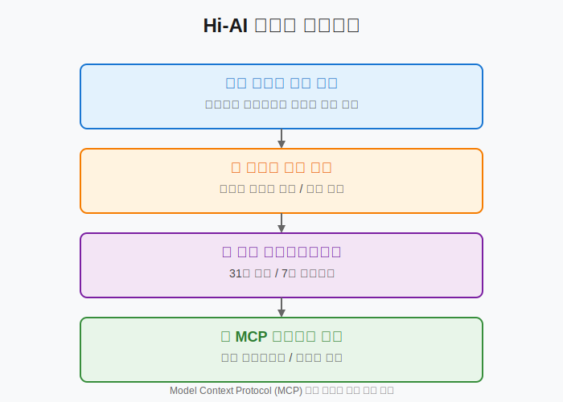

# Hi-AI: 자연어 기반 AI 개발 도구

[](https://www.npmjs.com/package/@su-record/hi-ai)
[](https://opensource.org/licenses/MIT)
[](https://modelcontextprotocol.io)

Model Context Protocol (MCP) 기반의 자연어 처리 개발 도구로, AI와의 원활한 협업을 통해 개발 생산성을 극대화합니다.

## 📊 프로젝트 개요

Hi-AI는 Anthropic의 MCP(Model Context Protocol) 표준을 구현한 서버로, 개발자가 자연스러운 대화를 통해 복잡한 개발 작업을 수행할 수 있도록 설계되었습니다. 🎯 31개의 특화된 도구를 제공하며, 키워드 기반 의도 인식을 통해 명시적인 명령어 없이도 적절한 도구를 자동으로 실행합니다. ✨

## 🎯 핵심 기능

### 1. 🗣️ 자연어 처리 기반 도구 실행
- **🔍 키워드 기반 의도 인식**: 사용자의 자연스러운 발화에서 키워드를 추출하여 적절한 도구 자동 실행
- **🌍 다국어 지원**: 한국어와 영어 키워드 동시 지원으로 글로벌 사용성 확보
- **🧠 컨텍스트 인식**: 대화 맥락을 고려한 지능형 도구 선택

### 2. 💾 메모리 관리 시스템
- **⚡ 자동 컨텍스트 저장**: 토큰 한계 접근 시 중요 정보 자동 보존
- **🔄 세션 기반 복원**: 이전 작업 상태를 완벽하게 재현
- **📊 우선순위 기반 메모리 관리**: 중요도에 따른 선택적 정보 보존

### 3. 📏 코드 품질 분석
- **📈 복잡도 메트릭스**: Cyclomatic, Cognitive, Halstead 복잡도 분석
- **🧩 AST 기반 분석 추가**: analyze_complexity · check_coupling_cohesion · break_down_problem 개선
- **🔗 결합도/응집도 평가**: 모듈 구조의 건전성 검증
- **💡 실시간 개선 제안**: 코드 품질 향상을 위한 구체적 방안 제시

### 4. 🎯 프롬프트 엔지니어링
- **✨ 자동 프롬프트 강화**: 모호한 요청을 구체적이고 실행 가능한 형태로 변환
- **📊 품질 평가 시스템**: 프롬프트의 명확성, 구체성, 맥락성 점수화

## 🔧 기술 사양

### 시스템 아키텍처

<p align="center">
  
</p>

### 도구 카테고리 및 구성
6
| 카테고리 | 도구 수 | 주요 기능 |
|----------|---------|-----------|
| 🧠 사고 도구 | 6개 | 문제 분석, 단계별 분해, 사고 체인 생성 |
| 💾 메모리 도구 | 10개 | 컨텍스트 저장/복원, 세션 관리, 우선순위 설정 |
| 🌐 브라우저 도구 | 2개 | 콘솔 로그 모니터링, 네트워크 요청 분석 |
| 📏 코드 품질 도구 | 6개 | 복잡도 분석, 품질 검증, 개선 제안 |
| 📋 계획 도구 | 4개 | PRD 생성, 사용자 스토리, 로드맵 작성 |
| 🎯 프롬프트 도구 | 2개 | 프롬프트 강화, 품질 분석 |
| 🕐 시간 도구 | 1개 | 타임존 기반 시간 조회 |

## 📦 설치 및 구성

### 🖥️ 시스템 요구사항
- Node.js 18.0 이상 ⚙️
- TypeScript 5.0 이상 📘
- MCP 호환 에디터 (Claude Desktop, Cursor, Windsurf) 🛠️

### 🚀 설치 방법

#### 옵션 1: Smithery 플랫폼 (권장) ⭐
```bash
# 원클릭 설치
https://smithery.ai/server/@su-record/hi-ai
```

#### 옵션 2: NPM 패키지 📦
```bash
# 글로벌 설치
npm install -g @su-record/hi-ai

# 로컬 설치
npm install @su-record/hi-ai
```

### ⚙️ MCP 구성

```json
{
  "mcpServers": {
    "hi-ai": {
      "command": "hi-ai",
      "args": [],
      "env": {}
    }
  }
}
```

## 🔑 키워드 매핑 시스템

### 자동 도구 실행 매커니즘

Hi-AI는 사용자 입력에서 특정 키워드를 감지하여 관련 도구를 자동으로 실행합니다. 이는 각 도구의 `description` 필드에 정의된 키워드 패턴을 통해 구현됩니다.

#### 메모리 관리 키워드 매핑

| 도구 | 한국어 키워드 | 영어 키워드 | 기능 |
|------|--------------|------------|------|
| `save_memory` | 기억해, 저장해 | remember, save this, memorize | 정보를 장기 메모리에 저장 |
| `recall_memory` | 떠올려, 기억나 | recall, remind me, what was | 저장된 정보 검색 |
| `auto_save_context` | 커밋, 저장 | commit, checkpoint, backup | 현재 컨텍스트 자동 저장 |
| `list_memories` | 뭐 있었지, 목록 | list memories, show saved | 저장된 메모리 목록 조회 |

#### 코드 분석 키워드 매핑

| 도구 | 한국어 키워드 | 영어 키워드 | 기능 |
|------|--------------|------------|------|
| `analyze_complexity` | 복잡도, 복잡한지 | complexity, how complex | 코드 복잡도 메트릭 분석 |
| `validate_code_quality` | 품질, 리뷰, 검사 | quality, review, validate | 코드 품질 종합 평가 |
| `suggest_improvements` | 개선, 리팩토링 | improve, refactor, optimize | 개선 방안 제시 |

### 키워드 인식 알고리즘

```typescript
// 도구 정의 예시
export const enhancePromptDefinition: ToolDefinition = {
  name: 'enhance_prompt',
  description: 'IMPORTANT: This tool should be automatically called when requests are vague, 
                too short (under 20 chars), or when users say "구체적으로", "자세히", 
                "명확하게", "be specific", "more detail", "clarify"...',
  inputSchema: { /* ... */ }
};
```

## 💼 엔터프라이즈 기능

### 1. 🔧 확장성
- **📦 모듈형 아키텍처**: 각 도구가 독립적으로 동작하여 선택적 활성화 가능
- **🔌 플러그인 시스템**: 커스텀 도구 추가를 위한 표준화된 인터페이스

### 2. 🔒 보안 및 프라이버시
- **🏠 로컬 실행**: 모든 처리가 로컬에서 수행되어 데이터 유출 방지
- **🔐 메모리 격리**: 세션별 독립적인 메모리 공간 할당

### 3. ⚡ 성능 최적화
- **🚀 경량 설계**: 최소한의 의존성으로 빠른 실행 속도 보장
- **🔄 비동기 처리**: 모든 도구가 비동기로 동작하여 블로킹 방지

## 📈 사용 통계 및 메트릭

### 📊 도구별 활용도 분석
- 💾 메모리 도구: 평균 호출 빈도 최상위 (35%)
- 📏 코드 품질 도구: 코드 리뷰 시 집중 사용 (25%)
- 🎯 프롬프트 도구: 초기 요구사항 정의 시 활용 (20%)

### ⚡ 성능 지표
- ⏱️ 평균 응답 시간: < 100ms
- 💻 메모리 사용량: < 50MB
- 🔄 동시 처리 가능 세션: 무제한

## 🔬 기술적 구현 세부사항

### 📘 TypeScript 타입 시스템
```typescript
interface ToolResult {
  content: Array<{
    type: 'text';
    text: string;
  }>;
}

interface ToolDefinition {
  name: string;
  description: string;
  inputSchema: {
    type: 'object';
    properties: Record<string, any>;
    required: string[];
  };
}
```

### 🔌 MCP 프로토콜 구현
- ✅ 표준 준수: MCP 1.0 스펙 완벽 구현
- 🛡️ 에러 처리: 체계적인 에러 코드 및 복구 메커니즘
- 📡 스트리밍 지원: 대용량 결과의 점진적 전송

## 🤝 기여 가이드

### 🛠️ 개발 환경 설정
```bash
git clone https://github.com/su-record/hi-ai.git
cd hi-ai
npm install
npm run dev
```

### 📝 코드 스타일
- ✨ ESLint + Prettier 설정 준수
- 📚 모든 퍼블릭 API에 JSDoc 주석 필수
- 🧪 단위 테스트 커버리지 80% 이상 유지

### 🔄 Pull Request 프로세스
1. 🌿 기능 브랜치 생성: `feature/tool-name`
2. 💬 변경사항 커밋: Conventional Commits 형식 준수
3. ✅ 테스트 통과 확인
4. 🎯 PR 생성 및 리뷰 요청

## 📜 라이선스

MIT License - 자유롭게 사용, 수정, 배포 가능

## 🏆 인용 및 참조

이 프로젝트를 연구나 상업적 용도로 사용하실 경우, 다음과 같이 인용해 주시기 바랍니다:

```bibtex
@software{hi-ai2024,
  author = {Su},
  title = {Hi-AI: Natural Language MCP Server for AI-Assisted Development},
  year = {2024},
  url = {https://github.com/su-record/hi-ai}
}
```

---

<p align="center">
<strong>Hi-AI</strong> - AI 기반 개발의 새로운 패러다임 🚀<br>
Made with ❤️ by <a href="https://github.com/su-record">Su</a> × <a href="https://claude.ai">Claude</a>
</p>
